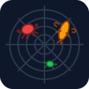

<p align="center">
  
</p>

# ClawMatrix

**Fleet management for AI agents.** Register agents, control their network access, browse their workspaces, schedule tasks, and monitor everything — from one dashboard or a single API.

*Run any agent runtime — OpenClaw, PicoClaw, NanoClaw, or your own — and manage them all through one common control plane.*

> **Status: Vibecoded, actively used.** This project was built to validate the idea — can a lightweight control plane make running AI agents in production less chaotic? We use it ourselves. It works, but the code was written fast: no tests, no hardened error handling, no stable API guarantees yet. If the idea gains traction, we'll do proper engineering — tests, e2e coverage, stable APIs. Use it, break it, tell us what you think.

**→ [See the dashboard in action](docs/dashboard.md)**

---

### What it does

You run AI agents in production. They make network requests, modify files, and run autonomously. ClawMatrix gives you a control plane to manage all of them.

```
                       Human
                         │
          ┌──────────────┴──────────────┐
          │                             │
    Coding Agent                    Dashboard
    (Claude Code,                   (Browser)
     Cursor, etc.)                      │
    via /llms.txt URL                   │
          │                             │
          └──────────────┬──────────────┘
                         │
                   ┌─────▼──────┐
                   │ ClawMatrix │
                   │  Control   │
                   │   Plane    │
                   └─────┬──────┘
                         │
           ┌─────────────┼─────────────┐
           │             │             │
        Agent A       Agent B       Agent C
```

<table>
<tr>
<td width="33%" valign="top">

**Agent discovery + connectivity** <br>Agents auto-register on boot. Define who can delegate to whom directly from the UI — no config files or code changes. OpenClaw servers autodiscover all agents they're running and register them in one shot. Connections are directed and routed local-first, then through the control plane across machines.

</td>
<td width="33%" valign="top">

**Fleet dashboard** <br>See every agent across deployments. Health status, latency stats, traffic counts — all in real time via SSE.

</td>
<td width="33%" valign="top">

**Workspace browser + editor** <br>Browse agent files from the UI. The built-in chat uses a special `[workspace-editor]` session — the agent switches into file-editor mode and corrects its own `SOUL.md`, skills, or memory files on demand. Same agent, no extra process.

</td>
</tr>
<tr>
<td width="33%" valign="top">

**Network allowlists** <br>Domain-level egress control per registration. Wildcards supported (`*.googleapis.com`). Every request logged, blocked requests get `403`.

</td>
<td width="33%" valign="top">

**Cron scheduling** <br>Schedule recurring or one-time messages to agents. Cron expressions, timezone support, execution history, manual triggers.

</td>
<td width="33%" valign="top">

**File locking** <br>Lock critical files (`SOUL.md`, `TOOLS.md`) with OS-level `chmod 444` from the UI. The agent gets "permission denied" — no prompt trick can override a kernel permission.

</td>
</tr>
<tr>
<td width="33%" valign="top">

**LLM-native API (`/llms.txt`)** <br>Point Claude Code at the URL and manage your fleet from the CLI. The API is documented in a format LLMs can read and call directly.

</td>
<td width="33%" valign="top">

**Connections** <br>Define directed agent-to-agent delegation links from the UI. `A → B` means A can delegate tasks to B. Manage the entire agent topology without touching config files or redeploying.

</td>
<td width="33%" valign="top">

**TLS via Let's Encrypt** <br>Set `TLS_DOMAIN` and the control plane automatically provisions and renews SSL certificates. Certs are stored in the database — no disk volume or cert manager needed.

</td>
</tr>
</table>

---

## Quick Start

### Docker Compose (easiest)

The [docker-compose-team](examples/docker-compose-team/) example spins up a full multi-agent stack — control plane, CEO, CTO, Marketing Manager, Sales Manager, and Tech Lead — with one command.

Download the binaries from [Releases](https://github.com/somit/clawmatrix/releases), place them in `examples/docker-compose-team/bin/`, then:

```bash
export ANTHROPIC_API_KEY=sk-ant-...
cd examples/docker-compose-team
docker compose up --build
```

Dashboard: http://localhost:8080

---

### Manual Setup

Run the control plane, then connect any agent to it with Clutch alongside.

#### 1. Download binaries

Grab the latest binaries for your platform from [Releases](https://github.com/somit/clawmatrix/releases):

- `clawmatrix` — the control plane server
- `clutch` — the sidecar proxy (Linux only for network enforcement; Mac for dev)

#### 2. Run the control plane

```bash
JWT_SECRET=your-secret ./clawmatrix
```

Then create your first admin user:

```bash
JWT_SECRET=your-secret ./clawmatrix createadmin --username admin --password <password>
```

Opens at http://localhost:8080. Log in with the credentials you just created.

#### 3. Create a registration

In the dashboard → **Registrations** → **New Registration**.

Give it a name (e.g. `my-agents`) and a token (e.g. `rt_my_token_123`). Optionally add allowlist domains to control what your agents can reach.

> The token you set here is what you pass to Clutch in step 4. Copy it before closing the dialog.

#### 4. Run Clutch alongside your agent

Clutch is the sidecar — it registers agents with the control plane, proxies `/ask` requests, and runs an embedded network sniffer (Linux, requires `CAP_NET_RAW` + `CAP_NET_ADMIN`).

**With OpenClaw:**

OpenClaw must be installed on the same host as Clutch. Start the gateway first, then Clutch:

```bash
# Terminal 1: start the openclaw gateway (reads ~/.openclaw/openclaw.json)
ANTHROPIC_API_KEY=sk-ant-... openclaw gateway run

# Terminal 2: start clutch — discovers agents from openclaw config and registers them
OPENCLAW_CONFIG=/path/to/openclaw.json \
./clutch \
  --control-plane http://localhost:8080 \
  --token rt_my_token_123 \
  --runner openclaw \
  --agent-id cto-id \
  --agent-gateway http://localhost:18789 \
  --listen 0.0.0.0:8090
```

Clutch reads the openclaw config (`OPENCLAW_CONFIG` env or `~/.openclaw/openclaw.json` by default), discovers all agents in it, and registers each one separately with the control plane. `--agent-id` is required to trigger discovery — it doesn't have to match any specific agent ID.

**With PicoClaw:**

Clutch spawns picoclaw as a subprocess on each `/ask` request:

```bash
./clutch \
  --control-plane http://localhost:8080 \
  --token rt_my_token_123 \
  --runner picoclaw \
  --agent-id my-agent \
  --agent-cmd "picoclaw agent" \
  --workspace /path/to/workspace \
  --sessions /path/to/workspace/sessions \
  --listen 0.0.0.0:8090
```

The agent appears in the dashboard as soon as Clutch registers it. Click it to chat, browse its workspace, or schedule crons.

#### 5. Set up connections (optional)

In the dashboard → **Connections** → **New Connection**. Define which agents can delegate to which — `A → B` means A can call `clutch delegate B "task"`.

---

## Data Model

ClawMatrix has 8 core entities. Here's what each one does and how they relate to each other.

### Registration

A **Registration** represents a hosted instance of an agent runtime — for example, an OpenClaw or PicoClaw process running on an Ubuntu server, a Docker container, or a Kubernetes pod. One registration can host one or more agents.

| Field        | Description                                                             |
| ------------ | ----------------------------------------------------------------------- |
| `name`       | Unique identifier (e.g. `openclaw-tech-team`, `picoclaw-ceo-office`)    |
| `token`      | Auth token used by the Clutch sidecar to register agents                |
| `allowlist`  | JSON list of allowed egress domains with wildcard support (`*.googleapis.com`) |
| `labels`     | JSON key-value metadata for filtering and grouping                      |
| `ttlMinutes` | Agent time-to-live; `-1` = persistent                                   |

When a Clutch sidecar boots alongside the agent runtime, it authenticates with the registration token and registers its agents under that registration.

### Agent

An **Agent** is an individual AI agent running under a registration. Multiple agents can share the same registration.

> **Important:** In ClawMatrix, `id` is the *instance* identifier (e.g. `cto-1`, `cto-2`). `name` is the logical agent type (e.g. `cto`, `techlead`). This allows multiple replicas of the same agent type with identical access and settings.

| Field              | Description                                                     |
| ------------------ | --------------------------------------------------------------- |
| `id`               | Agent instance ID (e.g. `cto-1`, `techlead-2`)                    |
| `name`             | Agent type / logical role (e.g. `cto`, `techlead`)                |
| `registrationName` | Which registration this agent belongs to                        |
| `templateName`     | Optional link to an AgentTemplate (future: infra provisioning)  |
| `status`           | `healthy`, `stale`, or `kill`                                   |
| `environment`      | JSON — runtime info (docker, k8s pod, GCP zone, etc.)           |
| `meta`             | JSON — URLs for chat, workspace, sessions endpoints             |
| `gateway`          | JSON — Clutch version, OS, arch, start time                     |
| `groups`           | JSON list of capability groups (bundles) assigned to this agent |
| `capabilities`     | JSON list of expanded capabilities (reported by agent/runtime)  |
| `stats*`           | Allowed/blocked counts, avg/min/max latency, request count      |

Agents send heartbeats every 30s with updated stats. If 3 heartbeats are missed (90s), the agent is marked `stale`.

### Connection

A **Connection** defines a directed link between two **agent instances**. This is what controls agent-to-agent delegation — who can talk to whom.

| Field              | Description                                      |
| ------------------ | ------------------------------------------------ |
| `registrationName` | Registration namespace the connection belongs to |
| `sourceAgentID`    | Agent instance that initiates (e.g. `cto-1`)     |
| `targetAgentID`    | Agent instance that receives (e.g. `techlead-1`)   |
| `purpose`          | Delegation purpose (default: `delegate`)         |

Connections are **directed**: `A → B` does not imply `B → A`. Create both if you want bidirectional communication.

> Note: If you want connections to apply to all replicas (e.g. `cto-* → techlead-*`), a future extension can add `sourceName`/`targetName` (agent type) based connections. For now, connections are explicit and instance-scoped.

When a multi-agent Clutch instance registers (e.g. an OpenClaw server with `cto` + `techlead`), connections between co-located agents can be auto-created based on local runner config (e.g. `subagents.allowAgents`).

### AgentTemplate

An **AgentTemplate** is a blueprint for provisioning agents (future feature). It defines the infrastructure configuration for spinning up new agent instances from the UI.

| Field              | Description                                         |
| ------------------ | --------------------------------------------------- |
| `name`             | Template identifier                                 |
| `registrationName` | Which registration agents from this template use    |
| `image`            | Container image (future)                            |
| `maxCount`         | Maximum agents from this template (`0` = unlimited) |
| `ttlMinutes`       | Agent TTL (`-1` = persistent)                       |
| `config`           | JSON — infra provisioning config                    |

### CronJob

A **CronJob** schedules messages to be sent to agents on a recurring or one-time basis.

| Field              | Description                                                    |
| ------------------ | -------------------------------------------------------------- |
| `name`             | Job name                                                       |
| `agentName`        | Target agent profile name (e.g. `ceo`)                         |
| `registrationName` | Preferred registration to route to; falls back to any healthy agent with the same profile name |
| `schedule`         | 5-field cron expression (e.g. `0 9 * * 1`) — for recurring    |
| `runAt`            | RFC3339 datetime — for one-time execution; auto-disables after firing |
| `timezone`         | IANA timezone (e.g. `Asia/Kolkata`). Default: `UTC`            |
| `session`          | Chat session name for continuity across runs                   |
| `message`          | Prompt delivered to the agent when the cron fires              |
| `enabled`          | Toggle on/off                                                  |

> **Coming soon:** Each cron job will support a **notification channel** — after the agent responds, the output is forwarded to a configured channel group (e.g. a WhatsApp group, a Slack user, a set of contacts). Admins will define channel groups from the UI, and any cron can be pointed at one. See Roadmap.

#### Cron API — Admin (Bearer token)

| Method | Path | Description |
|--------|------|-------------|
| `GET` | `/crons` | List all cron jobs (filter: `?type=<registrationName>`) |
| `POST` | `/crons` | Create a cron job (`name`, `agentId`, `message`, `schedule`\|`runAt` required) |
| `GET` | `/crons/{id}` | Get a single cron job |
| `PUT` | `/crons/{id}` | Update a cron job (any field) |
| `DELETE` | `/crons/{id}` | Delete a cron job |
| `POST` | `/crons/{id}/trigger` | Run a cron job immediately |
| `GET` | `/crons/{id}/executions` | List execution history |

#### Cron API — Agent (Registration token via clutch)

| Method | Path | Description |
|--------|------|-------------|
| `GET` | `/agent-crons` | List cron jobs for this registration |
| `POST` | `/agent-crons` | Create a cron job — `agentName` and `registrationName` auto-derived from token |
| `PUT` | `/agent-crons/{id}` | Update timing only (`schedule`, `runAt`, `timezone`) |
| `DELETE` | `/agent-crons/{id}` | Delete a cron job owned by this registration |

### CronExecution

A **CronExecution** is a log entry for each time a cron job runs.

| Field        | Description                               |
| ------------ | ----------------------------------------- |
| `cronJobID`  | Which cron job ran                        |
| `agentID`    | Which agent instance received the message |
| `status`     | `success` or `error`                      |
| `error`      | Error message if failed                   |
| `durationMs` | How long the execution took               |

### RequestLog

A **RequestLog** records every HTTP request an agent makes through the Clutch proxy.

| Field              | Description                           |
| ------------------ | ------------------------------------- |
| `agentID`          | Which agent instance made the request |
| `registrationName` | Registration the agent belongs to     |
| `domain`           | Target domain                         |
| `method`           | HTTP method                           |
| `path`             | Request path                          |
| `action`           | `allowed` or `blocked`                |
| `statusCode`       | HTTP status code                      |
| `latencyMs`        | Request latency                       |

### Metric

A **Metric** is a time-series snapshot of agent stats, recorded on each heartbeat.

| Field                       | Description                         |
| --------------------------- | ----------------------------------- |
| `agentID`                   | Which agent instance                |
| `registrationName`          | Registration the agent belongs to   |
| `allowed` / `blocked`       | Request counts since last heartbeat |
| `avgMs` / `minMs` / `maxMs` | Latency stats                       |
| `reqCount`                  | Total requests                      |

### AuditEvent

An **AuditEvent** logs administrative actions for traceability.

| Field       | Description                                                       |
| ----------- | ----------------------------------------------------------------- |
| `eventType` | e.g. `registration:created`, `connection:deleted`, `agent:killed` |
| `data`      | JSON payload with event details                                   |

---

## Flow

### Agent Registration Flow

OpenClaw autodiscovers all agents from its config file and includes them in a single `/register` call. PicoClaw registers one agent per container.

```
Clutch (sidecar)                    Control Plane
     │                                    │
     │  POST /register                    │
     │  {token, id, subagents[], env}     │
     │ ──────────────────────────────────>│
     │                                    │  1. Validate registration token
     │                                    │  2. Create Agent records (primary + subagents)
     │                                    │  3. Auto-create Connections between co-located agents
     │                                    │  4. Return agent tokens + allowlist
     │  <──────────────────────────────── │
     │                                    │
     │  POST /heartbeat (every 30s)       │
     │  {stats: allowed, blocked, latency}│
     │ ──────────────────────────────────>│  Update agent stats + last heartbeat
     │  <──────────────────────────────── │  Return {status, kill signal if TTL expired}
     │                                    │
     │  POST /logs (every 5s)             │
     │  [{domain, method, action, ...}]   │
     │ ──────────────────────────────────>│  Batch insert request logs
     │                                    │
     │  GET /config (every 5m)            │
     │ ──────────────────────────────────>│  Return latest allowlist (If-Modified-Since)
     │                                    │
     │  DELETE /register/{id} (shutdown)  │
     │ ──────────────────────────────────>│  Mark agent as deregistered
```

### Agent-to-Agent Delegation Flow

```
Agent A (cto)         Clutch A         Control Plane         Clutch B         Agent B (techlead)
     │                   │                   │                   │                   │
     │  clutch      │                   │                   │                   │
     │  delegate techlead  │                   │                   │                   │
     │  "review this PR" │                   │                   │                   │
     │ ─────────────────>│                   │                   │                   │
     │                   │  Is techlead local? │                   │                   │
     │                   │  Yes ────────────>│ (skip)            │                   │
     │                   │  POST techlead:8080 │                   │                   │
     │                   │  /ask             │                   │                   │
     │                   │ ──────────────────────────────────────────────────────────>│
     │                   │                   │                   │                   │
     │                   │  No (remote) ─────│                   │                   │
     │                   │  POST /agent-chat/│techlead             │                   │
     │                   │ ─────────────────>│                   │                   │
     │                   │                   │ 1. Check Connection exists (A→B)
     │                   │                   │ 2. Find target agent instance by ID
     │                   │                   │ 3. Proxy to target agent chatUrl
     │                   │                   │ ──────────────────────────────────────>│
     │                   │                   │                   │         POST /ask  │
     │                   │                   │                   │ ─────────────────> │
     │  <───────────────────────────────────────────────────────────────────────────  │
```

### Request Proxying Flow

```
Agent                  Clutch (sidecar)              External Service
  │                         │                              │
  │  HTTP request           │                              │
  │  (via HTTPS_PROXY)      │                              │
  │ ───────────────────────>│                              │
  │                         │  Check domain vs allowlist   │
  │                         │                              │
  │                         │  [ALLOWED]                   │
  │                         │  Forward request ──────────> │
  │                         │  <───────────── Response ──  │
  │                         │  Buffer log entry            │
  │  <───────── Response ── │                              │
  │                         │                              │
  │                         │  [BLOCKED]                   │
  │  <── 403 Forbidden ──── │                              │
  │                         │  Buffer log entry            │
```

---

## Architecture

```
┌─────────────────────────────────────────┐
│              Control Plane              │
│  ┌───────────┐ ┌──────┐ ┌───────────┐  │
│  │  REST API  │ │  UI  │ │  Workers  │  │
│  └─────┬─────┘ └──┬───┘ └─────┬─────┘  │
│        └──────────┼──────────┘          │
│              ┌────┴────┐                │
│              │SQLite/PG│                │
│              └─────────┘                │
└──────────────────┬──────────────────────┘
                   │
        ┌──────────┼──────────┐
        │          │          │
   ┌────┴───┐ ┌───┴────┐ ┌───┴────┐
   │ Clutch │ │ Clutch │ │ Clutch │
   │(sidecar)│ │(sidecar)│ │(sidecar)│
   └────┬───┘ └───┬────┘ └───┬────┘
        │         │          │
     Agent A   Agent B    Agent C
```

**Control Plane** — Go server with SQLite or PostgreSQL. Manages registrations, agents, connections, cron jobs, request logs and metrics. Ships with an embedded admin UI.

**Clutch** — Sidecar that runs alongside each agent runtime. It handles:
- **Registration** — connects to the control plane on boot, registers agents (including multi-agent autodiscovery for OpenClaw), and keeps heartbeats alive
- **Egress enforcement (sniffer)** — embedded packet capture goroutine listens on a raw `AF_PACKET` socket, extracts SNI hostnames from TLS ClientHello and `Host` headers from HTTP, matches against the registration's allowlist, and reactively adds `iptables REJECT` rules for blocked destinations. Requires `CAP_NET_RAW` + `CAP_NET_ADMIN`. Runs only on Linux
- **Agent gateway** — serves `/ask` for incoming chat, `/workspace` for file access, `/sessions` for session history, and `/delegate` for agent-to-agent delegation
- **Agent-to-agent delegation** — local-first (same clutch instance), falls back to routing through the control plane for remote agents

**Agent runtimes supported:**
- **OpenClaw** — Node.js agent platform, multi-agent per container, autodiscovers all agents from its config file and registers them in one shot. Uses an HTTP gateway sidecar (`openclaw gateway run`) for clean subprocess lifecycle management ✅ tested
- **PicoClaw** — lightweight Go agent, single-agent per container, communicates via subprocess 🔄 undergoing testing
- **NanoClaw** — planned next

Clutch uses an `AgentRunner` interface (`clutch/internal/runner.go`) to support different runtimes. Adding a new one means implementing the interface in `clutch/internal/runner_<name>.go` and wiring it up in the runner factory. See `CONTRIBUTING.md` for details. If you build support for another agent platform, open a PR against `clutch/`.

```yaml
# docker-compose example — openclaw multi-agent with gateway sidecar
tech-team:
  image: your-clutch-image
  cap_add: [NET_RAW, NET_ADMIN]    # enables embedded sniffer
  environment:
    - RUNNER=openclaw
    - AGENT_GATEWAY_URL=http://localhost:18789
    - CONTROL_PLANE_URL=http://control-plane:8080
    - REGISTRATION_TOKEN=<token>

tech-team-gateway:
  image: your-openclaw-image
  network_mode: "service:tech-team"  # shares loopback with clutch
  command: openclaw gateway run
```

**clutch CLI** — Command-line tool available inside agent containers for interacting with the local clutch gateway:

| Command | Description |
|---------|-------------|
| `clutch connections` | List agents this agent can delegate to |
| `clutch delegate <agent> "<message>" [session]` | Send a task to another agent |
| `clutch crons` | List all cron jobs |
| `clutch crons create '<json>'` | Create a new cron job |
| `clutch crons update <id> '<json>'` | Update cron timing (schedule, runAt, timezone) |
| `clutch crons delete <id>` | Delete a cron job |

Cron jobs require `name`, `message`, and either `schedule` (5-field cron expression) or `runAt` (RFC3339 one-time datetime). The agent profile and registration are derived automatically from the auth token — no need to specify them.

```bash
# Recurring: every Monday at 9am IST
clutch crons create '{"name":"weekly-review","schedule":"0 9 * * 1","timezone":"Asia/Kolkata","message":"Run the weekly review."}'

# One-time: fire once at a specific datetime
clutch crons create '{"name":"march-reminder","runAt":"2026-03-15T09:00:00+05:30","message":"Remind the team about Q1 goals."}'

# Update timing only
clutch crons update 42 '{"schedule":"0 10 * * 1"}'
```

`CLUTCH_URL` env var overrides the default gateway address (`http://127.0.0.1:8080`).

---

## Configuration

### Control Plane

| Env var | Default | Description |
|---------|---------|-------------|
| `JWT_SECRET` | *(required)* | Secret key used to sign JWT tokens |
| `LISTEN` | `:8080` | Listen address (ignored when TLS is enabled) |
| `DB` | `sqlite` | Database driver: `sqlite` or `postgres` |
| `DB_URI` | `/data/control-plane.db` | SQLite path or Postgres DSN |
| `BOOTSTRAP_CONFIG` | — | Path to JSON file for seeding registrations and connections on startup |
| `TLS_DOMAIN` | — | Domain for automatic TLS via Let's Encrypt (e.g. `cp.example.com`). When set, the server listens on `:80` (ACME challenge) and `:443` (HTTPS). Certificates are stored in the database and auto-renewed. |
| `TLS_EMAIL` | — | Contact email for Let's Encrypt expiry notifications |

> **TLS note:** `TLS_DOMAIN` requires the domain's DNS to point to the machine and ports 80 + 443 to be publicly reachable. Leave unset for plain HTTP (local / behind a load balancer).

### Clutch (sidecar)

| Env var | Description |
|---------|-------------|
| `CONTROL_PLANE_URL` | Control plane base URL (e.g. `http://control-plane:8080`) |
| `REGISTRATION_TOKEN` | Token from a Registration record |
| `AGENT_ID` | Agent instance ID |
| `HTTPS_PROXY` / `HTTP_PROXY` | Set inside the agent container to route traffic through Clutch |

---

## Notes

* **Tools/skills** currently live inside the OpenClaw/PicoClaw container image.
* ClawMatrix focuses on **fleet control-plane concerns**: discovery, egress policy, delegation, scheduling, and observability.
---

## Roadmap

Things we plan to build if this gets traction:

**Communication channels + notification groups** — Two-way communication plane for agents and humans. Admins define **channel groups** from the UI — a group is a named collection of destinations (e.g. "leadership" = WhatsApp group A + Slack user X). Any cron job can be pointed at a channel group: when the cron runs and the agent responds, the output is automatically forwarded to every destination in the group. Initial focus on WhatsApp (groups and contacts), Telegram, and Slack. No webhook plumbing needed — configure once in the UI, attach to any cron.

**Inbound communication plane** — The same channel infrastructure works in reverse: humans send messages to an agent via WhatsApp, Telegram, or Slack, and the response comes back to the same channel. Closes the loop between scheduled agent output and human-initiated conversations.

**Per-user agent permissions** — Beyond fleet-level access, fine-grained control over who can invoke which agents and with what session scope. Useful when multiple teams share a fleet but need different access levels.

**Hardened agent security** — Today agents authenticate with static registration tokens. We plan to move towards short-lived, automatically rotated tokens and workload identity — similar to how SPIFFE/SPIRE works. Each agent instance would get a cryptographic identity tied to where it's running (container, pod, host), making token theft and replay attacks much harder. Agent-to-agent communication would be mutually authenticated rather than relying on bearer tokens passed through the control plane.

**Agent autodiscovery via Agent Cards** — Agents should advertise their own capabilities, description, and supported tasks in a structured format (aligned with the emerging Agent Card spec). The control plane would index these and enable capability-based routing — send a task to "whichever agent can do X" rather than a hardcoded agent ID.

---

## License

MIT — see [LICENSE](LICENSE).
