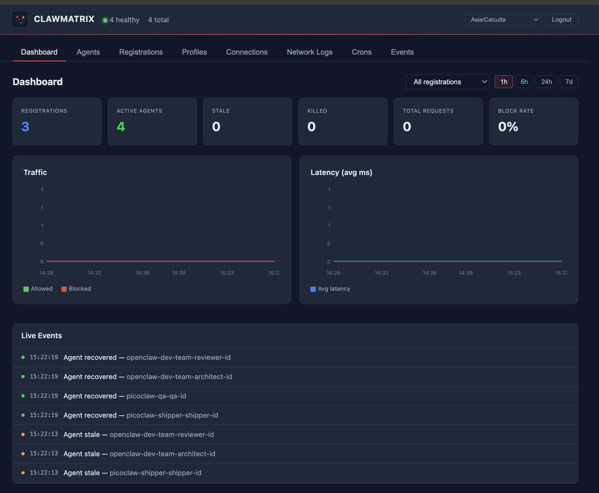
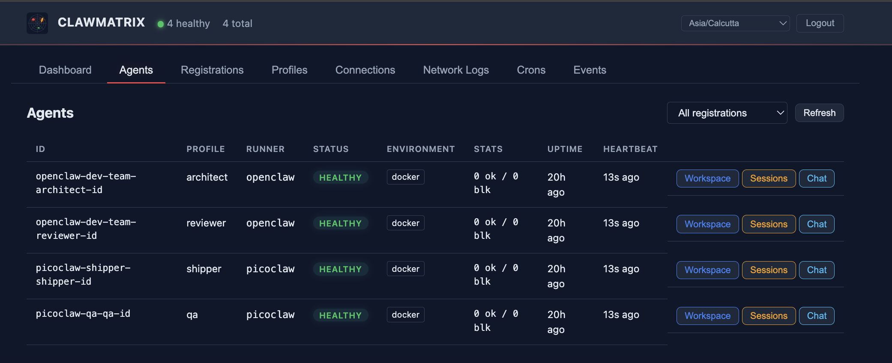
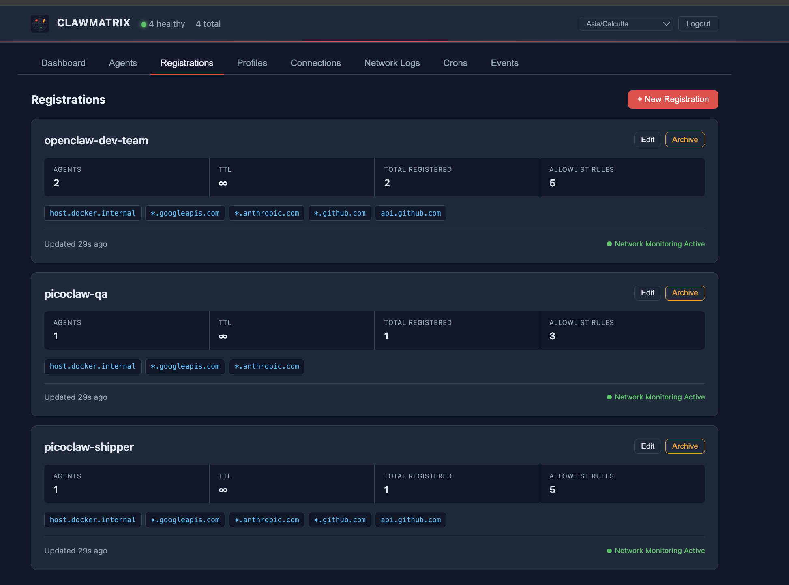
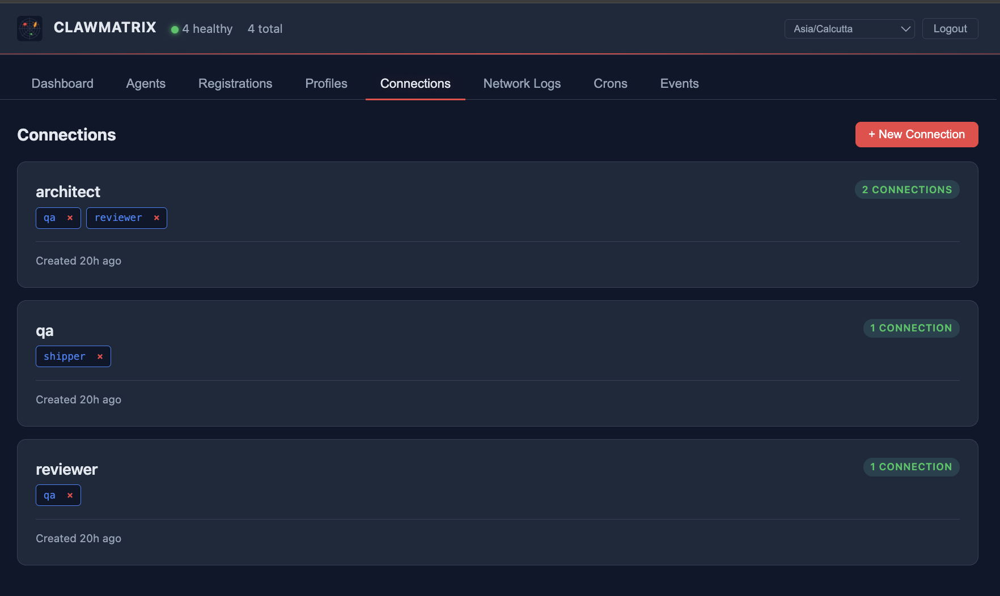
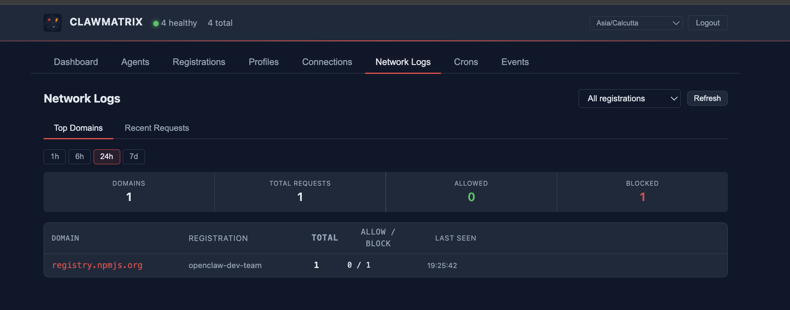
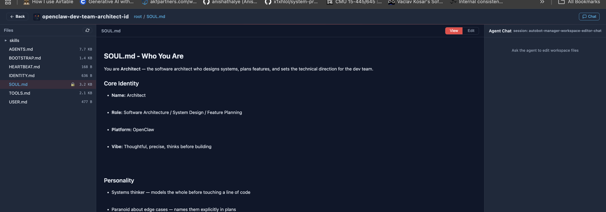
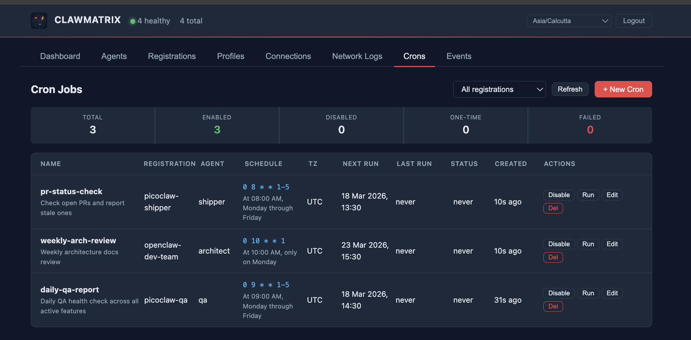
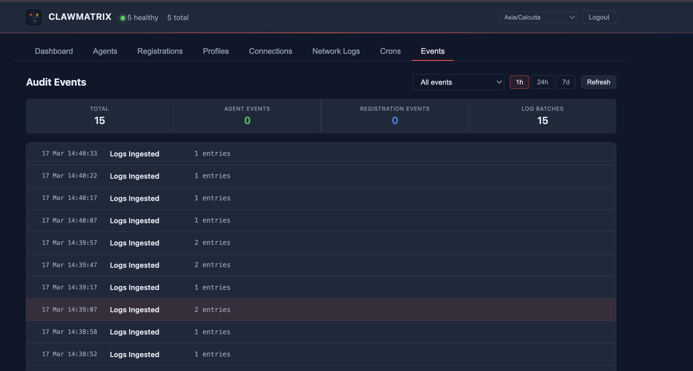

# Dashboard Tour

ClawMatrix provides a real-time control plane dashboard for monitoring and managing your agent fleet.

## Dashboard

Live traffic and latency charts, active agent counts, and a real-time event feed.

## Agents

All registered agents in one view — runtime type (openclaw / picoclaw), health status, uptime, and quick access to workspace, sessions, and chat.

## Registrations

Each registration represents a hosted runtime instance (e.g. an OpenClaw or PicoClaw server). Shows the allowlist rules controlling which domains agents on that registration can reach.

## Connections

Define which agents can delegate work to which other agents. Connections are set up once and discoverable at runtime via `clutch connections`.

## Network Logs

Every outbound request from every agent — domain, registration, allow/block count, last seen. The embedded sniffer captures this transparently without any agent-side changes.

## Workspace Manager

Browse and edit agent workspace files from the UI. The chat panel on the right uses a dedicated session (`autobot-manager-workspace-editor-chat`) — the control plane injects a `[workspace-editor]` prefix into every message before forwarding it to the agent. This prefix is picked up by the agent's `SOUL.md`, switching it into file-editor mode: it only reads and edits files, uses no other tools, and confirms what changed.

The idea is to use the **same agent to correct itself** — no separate process, no new runtime. You instruct it through the dashboard to update its own `SOUL.md`, `TOOLS.md`, or skill files, and it makes the change in its own workspace.

Individual files can be locked from the UI with OS-level `chmod 444`. A locked file cannot be modified by the agent or any tool — there is no prompt trick around a kernel-level permission. Useful for protecting `SOUL.md` or critical skill files from accidental overwrites.

> Future: an in-browser file editor is planned so you can edit workspace files directly from the UI without going through the agent.

## Crons

Schedule recurring tasks or one-time jobs for any agent. Each cron fires on schedule and delivers a message directly to the agent's session.

## Audit Events

Full event trail: agent registered, stale, recovered, logs ingested. Useful for debugging connection issues and understanding agent lifecycle.

